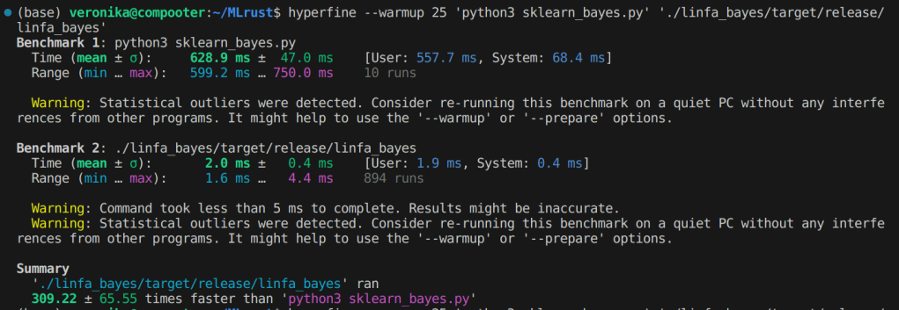

link to the article that mentions this example: [TODO]

## Methodology
The Rust and Python programs in this folder do the exact same process on the same data in order to compare the languages. 
I used the command line tool 'hyperfine' to benchmak the two programs. 
Note that for benchmarking I ran the linfa_bayes binary file since that is closer to how the code would be used in production.
(Including cargo/ build in the hyperfine benchmark still yeilds Rust being many times faster) 

Specs of the computer that was used: Intel(R) Core(TM) i5-10210U CPU @ 1.60GHz
Results will vary based on your computer and the tasks its running. 

I'd appreciate any and all feedback or follow-ups!
